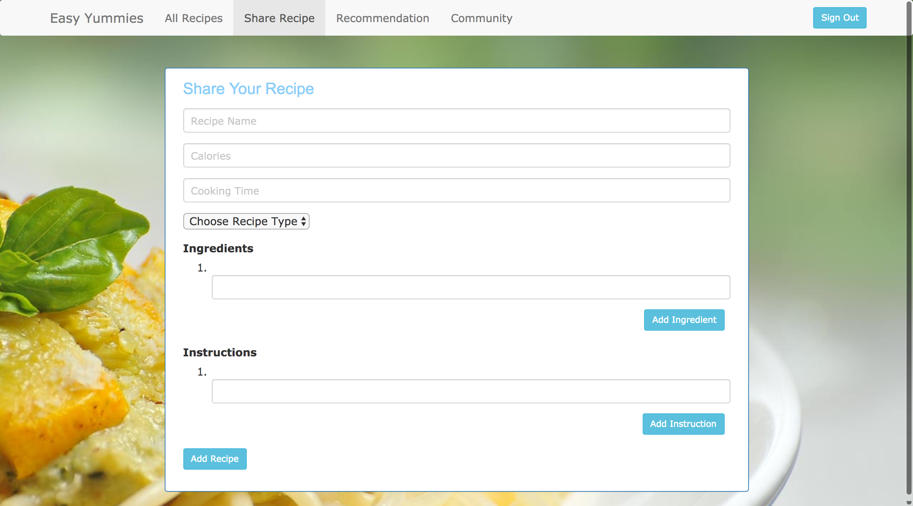

# Easy Yummies

1.	What is the proposed name for your Web application?
-Easy Yummies
2.	Who is the target audience for your Web application?
-People with limited culinary skills and spare time to cook easy and delicious meals
3.	What problem is it intended to solve for the target audience?
-People with limited culinary skills and little spare time often find it is difficult to find recipes that are easy to cook and yummy as well. On one hand, as an editor, I will publish some easy recipes for various categories (e.g. pasta, dessert, salad, etc.) regularly. On the other hand, registered users are invited to publish their own recipes as well. All published recipes are rated, commented by registered users. In addition, “Cooking FAQ Fo-um” is created to be dedicatedly serve as a discussion forum about tips and questions on cooking.
4.	How will it meet the minimum project requirements?
-Recipes can be browsed without a login. If a user wants to comment ,rate and pin the recipes, a login is required. Similar operation is applied to the discussion forum as well. All public data will be accessible through RESTful services.
5.	Why is your proposed Web application unique or creative beyond simply meeting the minimum requirements?
-I will rank the recipes based on ratings and number of views. 

##MOST RECENT CHANGES
* build a recipe entity and RESTful webservice


## Build status


[](https://travis-ci.org/infsci2560sp17/full-stack-web-jingyi-huang)


## Changelog
[Changelog](CHANGELOG.md)


## Web Site

[Easy Yummies](https://web2560.herokuapp.com/)

## Key Features

* User can review recipes details with login
* User can publish recipes with login
* User can rate any recipe with login
* User can review user details with login
* A recipe can be retrieved from its ID in JSON format


## Project Details

### Landing Page

TODO : please provide a description of your landing page inluding a screen shot 

### Display Page

Review a particular recipe details including its rating history, and rate it  

### User Input Form

TODO : please provide a description of at least 1 user input form including a screen shot 

## API

TODO : please provide a description of at least 1 API including a sample of request data and response data in both XML and JSON format.

### API Method 1

    GET recipes/{id}

#### Parameters

- **id** _(required)_ — The recipe id.


#### Response

A JSON  containing the PhotoID and list of tags accepted.

#### Errors

All known errors cause the resource to return HTTP error code header together with a JSON array containing at least 'status' and 'error' keys describing the source of error.

- **404 Not Found** — The photo was not found.

#### Example

##### Request

    POST /v1/photos/123456/tags

##### Body

    tags=cute,puppy


##### JSON Response

```json
{
    "photoId": 123456,
    "tags": ["cute", "puppy"]
}
```

##### XML Response

```xml
<?xml version="1.0" encoding="UTF-8"?>
<PhotoTags>
    <photoId>123456</PhotoId>
        <tags>
            <tag>cute</tag>
            <tag>puppy</tag>
        </tags>
</PhotoTags>


## Technologies Used

TODO : List all technologies used in your project

- [Spring Boot](https://projects.spring.io/spring-boot/) - Takes an opinionated view of building production-ready Spring applications.
- [Thymleaf](http://www.thymeleaf.org/) - Thymeleaf is a modern server-side Java template engine for both web and standalone environments.
- [Maven](https://maven.apache.org/) - Apache Maven is a software project management and comprehension tool.